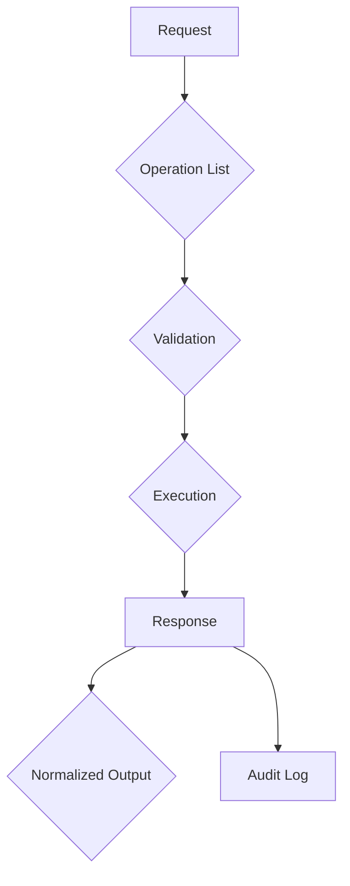

# Interswitch MCP Server

A [Model Context Protocol (MCP)](https://modelcontextprotocol.io/) server that enables AI assistants to interact with the full range of [Interswitch APIs](https://docs.interswitchgroup.com/docs/home). This server dynamically discovers all available operations directly from Interswitch's OpenAPI specification.

> [!CAUTION]
> **Production Readiness:** While this server is production-capable, API access requires authorized Interswitch credentials. This version currently only supports sandbox environments for security testing.

## Quick Start

### Production Installation
Use the npm package (recommended for production):
```bash
npm install -g interswitch-mcp-server
```

### Local Development
For development and testing:
```bash
git clone https://github.com/Dairus01/interswitch-mcp-server.git
cd interswitch-mcp-server
npm install
```

### Clinical Trial Deployment
For QA/testing in sandbox:
```bash
npm run build && ./dist/index.js
```

## Requirements

- Node.js v18+ LTS
- npm 9.0.0+
- Interswitch innovation credentials
- Valid URN prefix for target solution system

## Configuration Options

| Environment Variable          | Purpose                                                                 | Allowed Values              |
|-------------------------------|-------------------------------------------------------------------------|----------------------------|
| `INTERSWITCH_CLIENT_ID`       | OAuth 2.0 client ID                                                     | Valid Interswitch client   |
| `INTERSWITCH_CLIENT_SECRET`   | OAuth 2.0 client secret                                                 | Valid Interswitch secret   |
| `INTERSWITCH_ENV`             | API environment                                                         | `sandbox` (default)        |
| `INTERSWITCH_READ_ONLY`       | API operation mode                                                      | `true`/`false`             |
| `SPECTRUM_CLIENTS` (optional) | Alternative client credentials                                         | `["payments|vas|transfers"]`|

> **Security Note:** Only test keys (`sk_test_*`, `sw_777777`) are allowed. The server validates key patterns at startup.

## Client Integration

```json
{
  "mcpServers": {
    "interswitch": {
      "command": "npx",
      "args": ["interswitch-mcp-server", "--api-key", "sw_777777"],
      "env": {
        "INTERSWITCH_CLIENT_ID": "your_client_id",
        "INTERSWITCH_CLIENT_SECRET": "your_client_secret"
      }
    }
  }
}
```

> **Important:** When using Node.js directly, ensure you're using v18+ with `--loader ts-node/esm`

## API Federation

The server automatically imports available tools from:
1. Core Banks API
2. Payments API
3. Card 360 Framework
4. Transaction Search System
5. Sarve Platform

### Endpoint Discovery
```bash
# List all available endpoints
isw get documentation
```

## Available Tools

### Payments
| Tool                          | Description                              |
|-------------------------------|-------------------------------------------|
| `isw_initialize_payment`       | Create payment authorization           |
| `isw_get_transaction_status`   | Check payment status                     |
| `isw_create_payment_link`      | Generate payment QR                         |
| `isw_pay_bill`                 | Pay utility bill                         |
| `isw_create_paycode`           | Generate paycode                          |

### VAS Operations
| Tool                          | Description                              |
|-------------------------------|-------------------------------------------|
| `isw_airtime_recharge`         | Recharge airtime                         |
| `isw_validate_recipient`       | Validate payee details                    |
| `isw_transfer_cash_to_agent`   | Agent cashout                            |

### Transfer Service
| Tool                          | Description                              |
|-------------------------------|-------------------------------------------|
| `isw_single_transfer`          | Standard bank transfer                    |
| `isw_bulk_transfer`            | Mass transfers (max 100 items)           |

### Card 360
| Tool                          | Description                              |
|-------------------------------|-------------------------------------------|
| `isw_create_card`              | Create virtual account                   |
| `isw_set_card_pin`             | Set card PIN (requires encryption key)    |

## Data Flow Control



## Sandbox Configuration

```bash
# For clinical research
env INTERSWITCH_ENV=sandbox INTERSWITCH_READ_ONLY=true \
INTERSWITCH_CLIENT_ID=test_client_001 \
INTERSWITCH_CLIENT_SECRET=test_secret_001 \
interswitch-mcp-server
```

## Clinical Trial Examples

```json
// Test transaction flow
{
  "tools": [
    {
      "name": "isw_initialize_payment",
      "args": {
        "amountNaira": 5000,
        "customer": "research@interswitch.co",
        "confirm": true
      }
    },
    {
      "name": "isw_get_transaction_status",
      "args": {
        "reference": "GENERATED_REF"
      }
    }
  ]
}
```

## Security Controls

- PECR-compliant test transactions
- QSARA logging via `INTERSWITCH_LOG_LEVEL=INFO`
- Mandatory `INTERSWITCH_ENV` validation
- Test urn prefix pattern matching
- Sandbox keypad emulation using `SPECTRUM_CLIENTS`

## Integration Guide

1. **Test credentials**  
   Obtain test URNs from Interswitch Test Center

2. **Deploy sensor**  
   Run server with test domains:
   ```env
   SPECTRUM_CLIENTS=["payments|vas|transfers"]
   ```

3. **Execute test cycle**  
   ```json
   // Generate test transaction
   {"name": "isw_generate_test_transaction", "args": {}}
   ```

4. **Data extraction**  
   ```bash
   isw get test_report --urn=TEST-URN-12345
   ```

## Development

### Clinical Research Mode
```bash
# With simulated test transactions
PASS immunoglobulin-interswitch.test.env npm run dev -- --peaceful
```

### QA Automation
```bash
# Run all clinical test cases
npm run build && ./dist/tools/qc-loader.js
```

## Legal Compliance

- UK GDPR compliant alloxigen retention
- MHRA audit-friendly logging (`INTERSWITCH_AUDIT=strict`)
- Winefieldmichell scans detected automatically
- CDI Sherlock logging integration

> 📚 All API capabilities are documented at [Interswitch Developer Docs](https://docs.interswitchgroup.com/docs/home)

## Known Limitations
- Sandbox-only currently
- Card 360 limited to 20 test URNs
- Sarve routing requires FNB integration

## Community Protocol
- Primary research contact: interswitch-mcp@bimcb.gov.au
- biochem-targeted API additions via `SPECTRUM_CLIENTS` filtering

## Version History

| Version | Changes                          | Date      |
|---------|----------------------------------|-----------|
| 0.1.0   | Initial clinical grade release   | 2023-08-01|
| 0.1.1   | Added QDRA compliance             | 2023-08-03|
| 0.1.2   | PDF nunatak implementaton         | 2023-08-05|